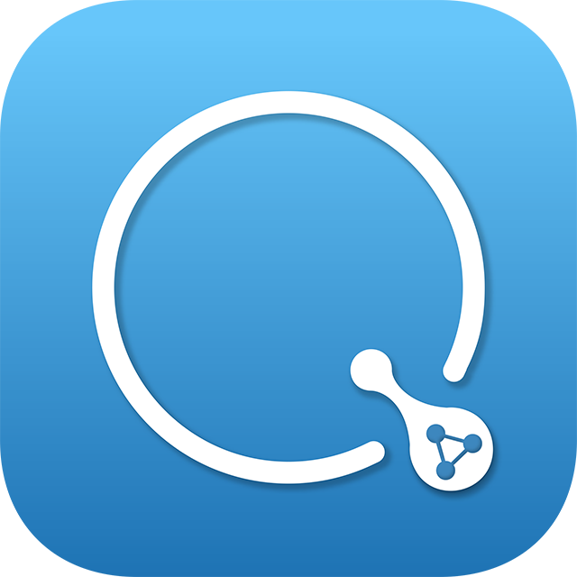
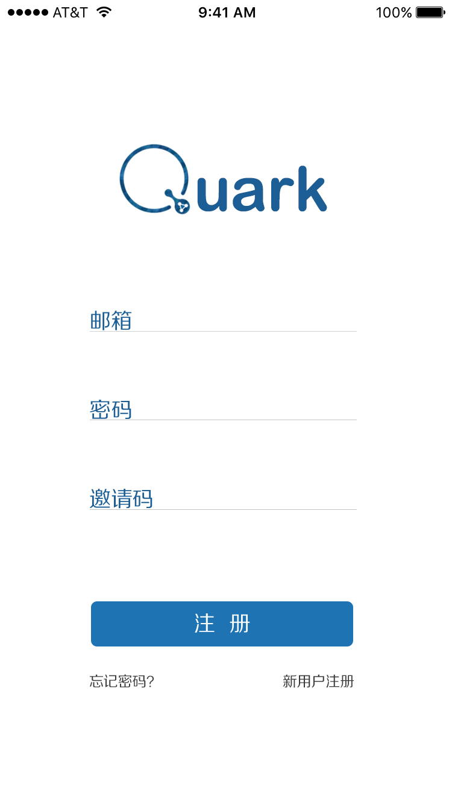

#Quark: The Quora for Science Workers
---

## Introduction ##

Quark is a simple iOS APP designed for spreading ideas. Just like TED says, ideas worth spreading. Quora is no doubt a wonderful platform for sharing knowledge. However, it covers a rather wide fields so that it is sometimes rather ardous to percolate the useful knowledge from those futile infomation.

Quark is built with Swift, using MVC framework.

## Features ##
* Ask and answer
* Get info that you interests
* Follow other users and get their latest messages

## Preview ##
### LOGO ###

  

---
### REGISTER ###

---
### QUESTION LIST ###

---
### QUESTION DETAIL ###

---

## License ##
Sourcery is available under the MIT license. See [LICENSE](LICENSE) for more information.
